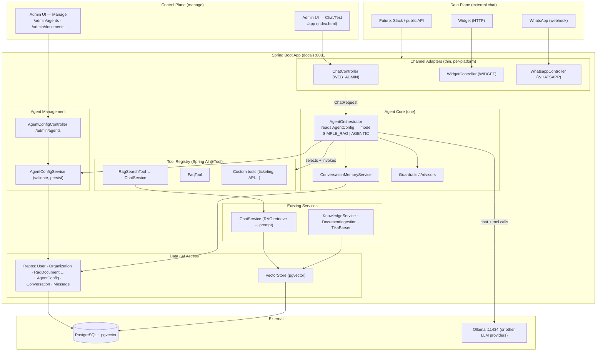

# Doc-AI — Configurable Agent & Multi-Channel Architecture

**Version:** 1.1.0
**Last updated:** 2026-08-08
**App version:** 0.0.1-SNAPSHOT (see `pom.xml`)
**Status:** Implemented on branch `feature/configurable-agent` (extends `docs/architecture.md`)

## Goal

Extend the current single-flow RAG app so that:

1. **Admins manage agent behavior from the existing Thymeleaf UI** — system prompt,
   model, enabled tools, guardrails — persisted per tenant (`AgentConfig`).
2. **Admins keep the existing chat UI (`/app`) to test the agent live** — the same
   `index.html` chat surface routes through the new agent core as `channel=WEB_ADMIN`,
   so admins can preview configured behavior before it reaches external channels.
3. **Multiple end-user channels** (embeddable **widget**, **WhatsApp**, future Slack/API)
   all talk to the **same agent core**, so a change made once in the UI applies everywhere.
4. **RAG-direct and agentic behavior are the same pipeline** — "direct RAG" is just the
   agent running with a single tool and no memory. No forked codepaths.

## Two planes, one core

- **Control plane (manage):** Admin UI → `AgentConfigController` → `AgentConfigService`
  → writes `AgentConfig`. Human admins, JWT + `ADMIN` role.
- **Data plane (chat):** end-user channels **and** the admin chat UI → thin **Channel
  Adapters** → normalized `ChatRequest` → **AgentOrchestrator** → reads the same
  `AgentConfig`.

The UI both **manages** agent behavior and **tests** it (via `/app` chat), while external
channels consume the exact same configuration.

## Component Diagram



## ASCII view

```
   CONTROL PLANE (admin UI)                        DATA PLANE (external chat)
 ┌───────────────────────────┐            ┌───────────────┬──────────────────┐
 │  Manage:  /admin/agents    │            │ Widget (HTTP) │ WhatsApp (webhook)│
 │           /admin/documents │            └───────┬───────┴─────────┬────────┘
 │  Test:    /app (chat UI)   │                    │                 │
 └─────┬───────────────┬─────┘                     │                 │
       │ writes config │ test chat (WEB_ADMIN)     ▼                 ▼
       │               └────────────┐   ┌───────────────────────────────────┐
       ▼                            ▼   │   CHANNEL ADAPTERS (thin)         │
 ┌─────────────────────────┐   ┌────────┤   normalize → ChatRequest         │
 │ AgentConfigController    │   │        └───────────────┬───────────────────┘
 │ AgentConfigService       │   │                        │ ChatRequest
 └───────────┬─────────────┘   │                        ▼
             │                  │        ┌───────────────────────────────────┐
             │  reads same cfg  └───────►│      AGENT CORE (one)             │
             ▼                           │  reads AgentConfig → mode         │
     ┌──────────────────────┐            │  AgentOrchestrator + memory       │
     │  AgentConfig table    │◄───read────┤  + tools (RagSearchTool, …)       │
     │  (per tenant)         │            └───────────────┬───────────────────┘
     └──────────────────────┘                            │
     PostgreSQL + pgvector                       ChatService (RAG) · Ollama
```

## Data model additions

- **`agent_config`** — one per tenant (optionally per channel later):
  `id, organization_id, name, mode (SIMPLE_RAG|AGENTIC), system_prompt, model,
  temperature, enabled_tools (json/text[]), top_k, similarity_threshold,
  max_context_chars, enabled (bool), created_at, updated_at`. RLS by `organization_id`.
- **`conversations`** — `id, organization_id, channel, user_ref, created_at, last_activity_at`.
- **`messages`** — `id, conversation_id, role (user|assistant|tool), content, tool_name,
  created_at`. RLS via parent conversation's `organization_id`.

## Design rules

1. **Channel = metadata**, not a fork. Adapters only handle transport (authn, payload
   parsing, sync vs. async reply, formatting) and produce a normalized
   `ChatRequest(tenantId, channel, userRef, text, conversationId)`.
2. **The admin chat UI (`/app`) is a channel too** — `channel=WEB_ADMIN`. It exercises the
   same core and config as external channels, so testing is faithful.
3. **Conversation identity** = `(organizationId, channel, userRef)` → resolves/creates a
   `conversationId` so memory works per platform without special-casing.
4. **`SIMPLE_RAG` == today's behavior** — orchestrator runs one tool (`RagSearchTool`)
   with no memory; equivalent to the current `ChatService.getKnownInfo(...)` path.
5. **Tenant isolation preserved** — `AgentConfig`, conversations, and vector search all
   filter by `organizationId` (existing RLS pattern).

## Migration to existing code

| Today | After |
|------|-------|
| `ChatController` → `ChatService` (fixed prompt) | `ChatController` = WEB_ADMIN adapter → `AgentOrchestrator` → tools → `ChatService` |
| Prompt/model hard-coded in `ChatService`/`application.yaml` | Per-tenant `AgentConfig` (UI-managed) |
| `WhatsappController` (TODO stub) | Real WhatsApp adapter (webhook in, Send API out) |
| Stateless requests | Optional `Conversation`/`Message` memory (AGENTIC mode) |
| Admin manages documents only | Admin manages agents at `/admin/agents` **and** tests them at `/app` |
| Chat UI hits raw RAG | Chat UI hits configured agent (live preview of admin changes) |

---

## Implementation status (v1.1.0)

Delivered on branch `feature/configurable-agent`:

- **Agent core** — `AgentOrchestrator.handle(ChatRequest)` is the single pipeline for
  every channel: `enabled-check → inbound guardrails → mode switch → outbound guardrails`.
- **Modes** — `SIMPLE_RAG` (behaviorally identical to the original app, delegates to
  `ChatService.getKnownInfo`) and `AGENTIC` (tool-calling + conversation memory).
- **Channels** — `WEB_ADMIN` (existing chat UI as a faithful test channel), `WIDGET`
  (public `POST /widget/chat` + embeddable `widget.js`), `WHATSAPP` (Cloud API webhook
  with verify + HMAC + async reply).
- **Configurable tools** — `AgentTool` interface + `ToolRegistry` auto-discovers tool
  beans by name. `AgentConfig.enabledTools` (CSV) selects them per tenant; blank = all
  tools. Adding a tool = add a bean, no orchestrator change. Tenant is passed via
  `ToolContext` (never chosen by the model).
- **Guardrails** — per-org sliding-window rate limit, input/output truncation, blocked-term
  redaction (redact before truncate).
- **Configurable disabled message** — `AgentConfig.disabledMessage` shown on every channel
  when `enabled=false` (falls back to a built-in default).
- **Conversation memory** — keyed by `(organizationId, channel, userRef)`. Idle timeout
  (`app.agent.conversation-idle-minutes`, default 30; `0` disables) clears stale history for
  a fresh start; explicit reset via `DELETE /faqs/conversation` (admin "New chat" button).
- **Admin UI** — `/admin/agents` (ADMIN-only) edits name, mode, system prompt, model,
  temperature, enabled tools, disabled message, and the enabled flag.

Configuration is **per organization**: exactly one `agent_config` row per tenant
(`uq_agent_config_org`), shared by all users and all channels in that org, isolated from
other orgs by RLS.

## Roadmap: agent scoping

Today a tenant has **one** agent. If differentiated behavior is needed later, choose the
lightest option that fits the actual need:

| Need | Recommended approach | Status |
|------|----------------------|--------|
| Different **companies / customers** (separate users, separate knowledge base) | **Separate organizations** — full isolation of config, documents, guardrails, memory | ✅ Available today |
| Same bot, **different tone/limits per channel** (e.g. terse on WhatsApp, detailed on web) | **Per-channel overrides** — same agent, small per-channel deltas on prompt/model | ⏳ Future (lightest) |
| **Multiple bots for one company**, sharing users and some documents (e.g. HR bot + Sales bot) | **Multiple agents per org** — drop `uq_agent_config_org`, add `agent_id` + a channel→agent mapping / default flag; `getForOrganization` → `getForOrganizationAndChannel`; add agent-select UI | ⏳ Future (heaviest) |

**Guidance**

- Using **separate orgs** as a stand-in for "multiple bots in one company" works for
  tenant-like separation, but has costs: a user belongs to exactly one org (needs multiple
  accounts to reach multiple bots), shared documents must be duplicated per org, and each
  WhatsApp number maps to a single org. Prefer it only when the split is truly a separate
  tenant/customer.
- When a real second use case appears, implement **per-channel overrides before**
  full multi-agent — it covers most "different behavior" needs at a fraction of the
  complexity, and the current schema was intentionally left open to layer it on without
  breaking the one-config-per-tenant contract.
