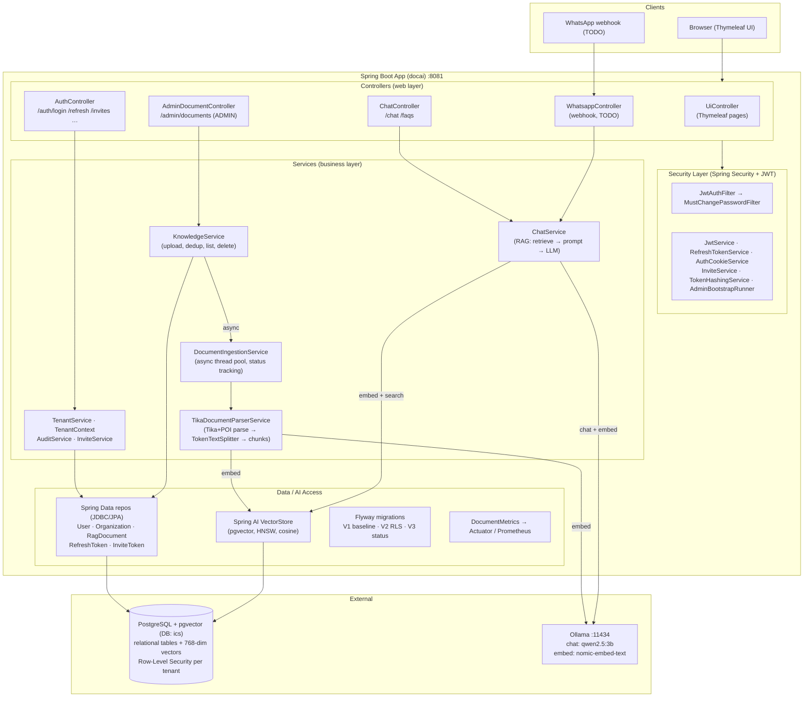

# Doc-AI — High-Level Architecture

**Version:** 1.0.0
**Last updated:** 2026-08-08
**App version:** 0.0.1-SNAPSHOT (see `pom.xml`)

Doc-AI is a multi-tenant RAG (Retrieval-Augmented Generation) application built on
Spring Boot 3.5 + Spring AI. Admins upload documents that are parsed, chunked, and
embedded into a pgvector store; users ask questions that are answered by retrieving
relevant chunks and passing them to a local Ollama LLM.

## Stack

- Spring Boot 3.5.4 · Java 17
- Spring AI 1.0.0 (Ollama chat + embeddings, pgvector vector store)
- PostgreSQL + pgvector (relational data + 768-dim embeddings, HNSW / cosine)
- Spring Security + JWT (cookie-based) · Flyway migrations
- Apache Tika + POI (document parsing) · Thymeleaf (UI)
- Micrometer / Prometheus (metrics) · Spring Boot Actuator

## Component Diagram

## Key Flows

1. **Auth** — JWT stored in cookies. Invite-based onboarding, hashed refresh tokens,
   forced password change, admin bootstrap, and role-based access (`ADMIN`).
2. **Ingestion (admin)** — upload → `KnowledgeService` (SHA-based dedup) → async
   `DocumentIngestionService` (bounded thread pool; status column drives UI polling)
   → Tika/POI parse → chunk → embed → pgvector.
3. **Query (RAG)** — `/chat` & `/faqs` → `ChatService` retrieves top-K similar chunks
   (cosine, similarity threshold 0.35) from pgvector → builds context prompt →
   Ollama LLM → answer.
4. **Multi-tenancy** — `TenantContext` + `TenantService` + Postgres Row-Level Security
   scope all data per `organizationId`.
