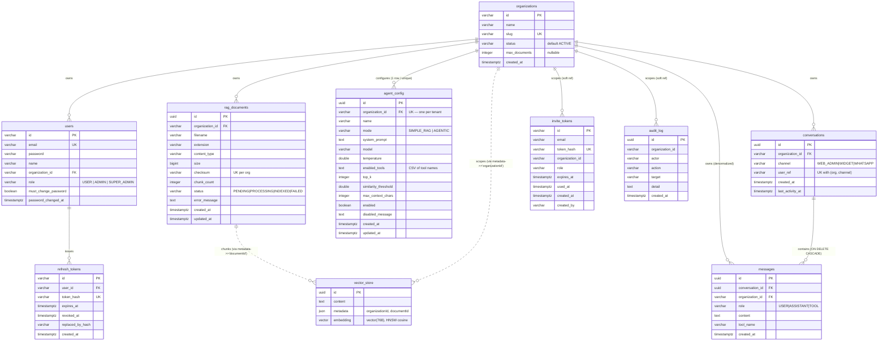

# Doc-AI — Database Schema (ER Diagram)

Version: 1.0.0 · Generated from Flyway migrations `V1`–`V6`.

PostgreSQL + `pgvector`. Every tenant-owned table carries `organization_id`, and
sensitive tables (`agent_config`, `conversations`, `messages`, plus V2 tables) enforce
Row-Level Security that filters on `app.current_org` (falls through to allow-all when
the setting is unset — migrations, seeding, admin jobs).

## Entity–relationship diagram



## Relationships & keys

| Table | PK | Foreign keys | Unique constraints |
|---|---|---|---|
| `organizations` | `id` (varchar) | — | `slug` |
| `users` | `id` | `organization_id → organizations.id` | `email` |
| `rag_documents` | `id` (uuid) | `organization_id → organizations.id` | `(organization_id, checksum)` |
| `vector_store` | `id` (uuid) | *soft* (metadata JSON) | — |
| `agent_config` | `id` (uuid) | `organization_id → organizations.id` | `organization_id` (one per tenant) |
| `conversations` | `id` (uuid) | `organization_id → organizations.id` | `(organization_id, channel, user_ref)` |
| `messages` | `id` (uuid) | `conversation_id → conversations.id` (CASCADE), `organization_id → organizations.id` | — |
| `invite_tokens` | `id` | *soft* `organization_id` (no FK) | `token_hash` |
| `refresh_tokens` | `id` | `user_id → users.id` | `token_hash` |
| `audit_log` | `id` (uuid) | *soft* `organization_id` (no FK) | — |

Notes:
- **`vector_store`** is Spring AI's managed table. It has no FK to `organizations` or
  `rag_documents`; tenancy and document linkage live in the `metadata` JSON
  (`organizationId`, `documentId`) with functional indexes for pre-filtering.
- **`invite_tokens`** and **`audit_log`** reference `organization_id` by value only
  (no FK) so audit entries and invites survive independently.
- **`agent_config`** is intentionally **one row per organization** (unique index);
  a missing row is served as an in-memory `SIMPLE_RAG` default by `AgentConfigService`.
- **`SUPER_ADMIN`** is a platform role stored in `users.role`; it is treated as a
  superset of `ADMIN` at the security layer (see `JwtAuthFilter`).

## Row-Level Security (tenant isolation)

RLS is `ENABLE`d + `FORCE`d on `agent_config`, `conversations`, `messages` (V4/V5),
and the V2-covered tables. Policies allow a row when:

```
current_setting('app.current_org', true) IS NULL
  OR current_setting('app.current_org', true) = ''
  OR organization_id = current_setting('app.current_org', true)
```

i.e. app requests scope to a single tenant; background jobs (unset `app.current_org`)
see everything. Toggle via `app.tenant.rls-enabled` (default false in dev).

## Migration history

| Migration | Adds |
|---|---|
| `V1__baseline` | `organizations`, `vector_store`, `rag_documents`, `users`, `invite_tokens`, `refresh_tokens`, `audit_log`; seeds `default-org` |
| `V2__row_level_security` | RLS policies for baseline tenant tables |
| `V3__document_status` | `rag_documents.status/error_message/updated_at` (async ingestion) |
| `V4__agent_config` | `agent_config` table + RLS + per-tenant SIMPLE_RAG seed |
| `V5__conversations` | `conversations`, `messages` (AGENTIC memory) + RLS |
| `V6__agent_disabled_message` | `agent_config.disabled_message` |
