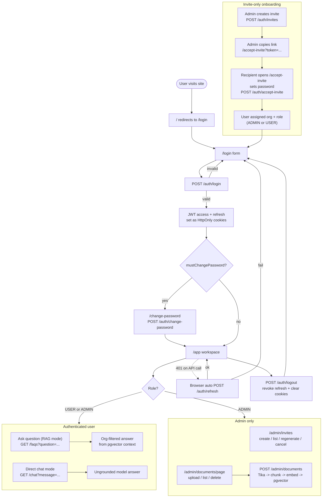
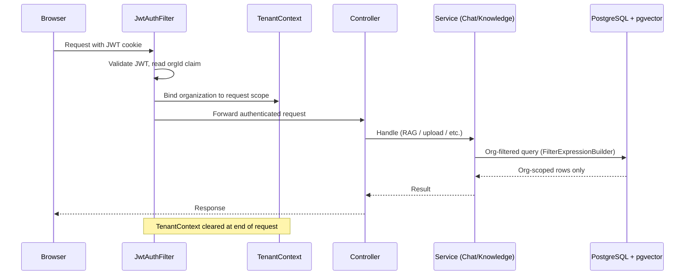
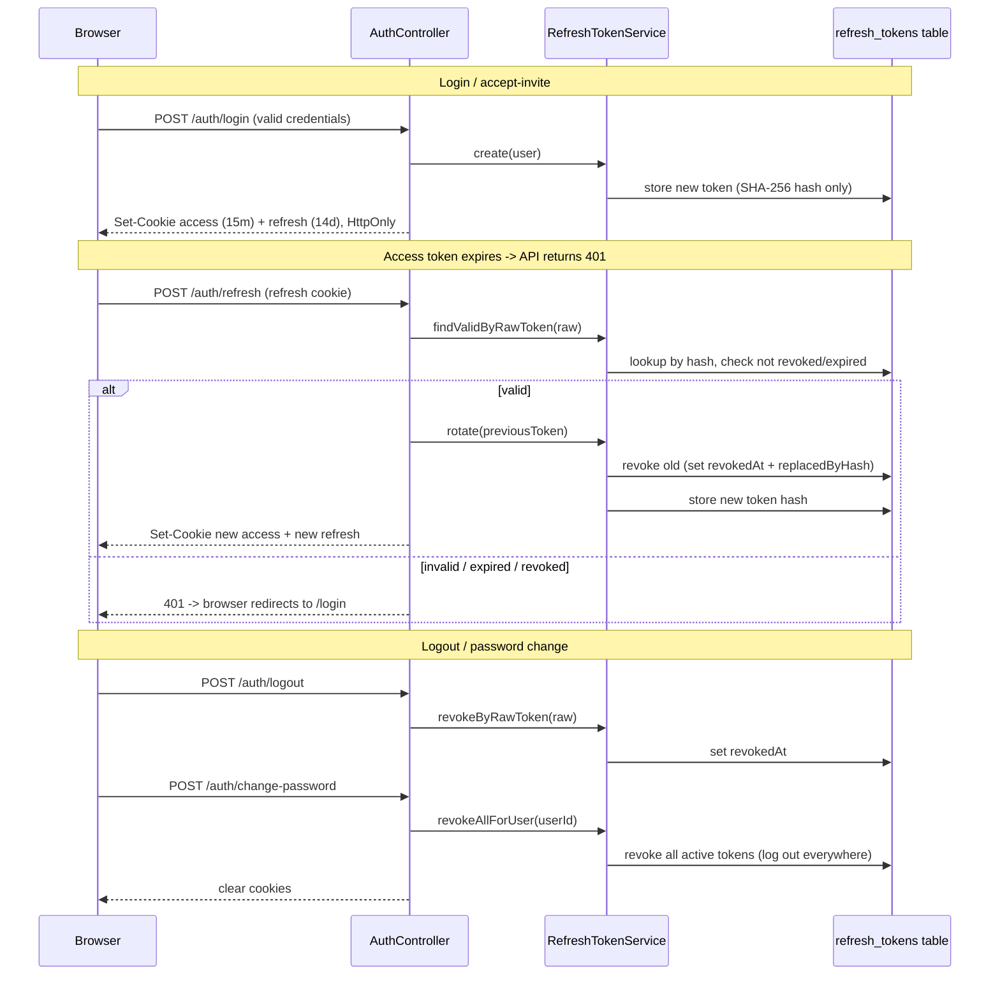

# Doc-AI User Flow

This diagram shows how users interact with Doc-AI today, from invitation through
authentication, document management, and RAG chat.

## User journey (activity flow)

## Request-time isolation (per authenticated request)

## Refresh-token rotation (session lifecycle)

Access tokens are short-lived (15 min); refresh tokens are long-lived (14 days) and
stored only as SHA-256 hashes. Each refresh **rotates** the token: the old one is
revoked and linked to its replacement, so a stolen/replayed old token is rejected.

